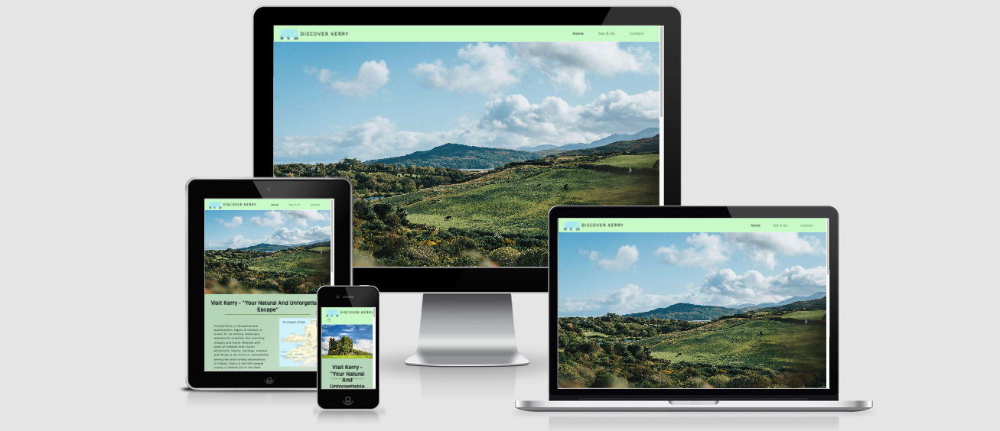
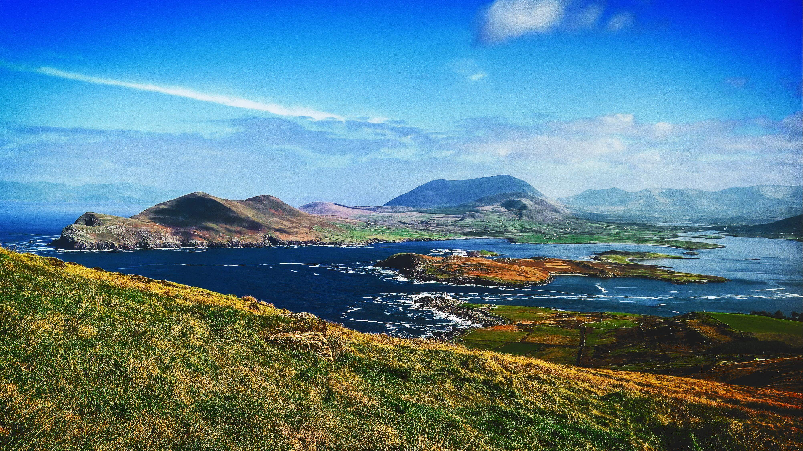
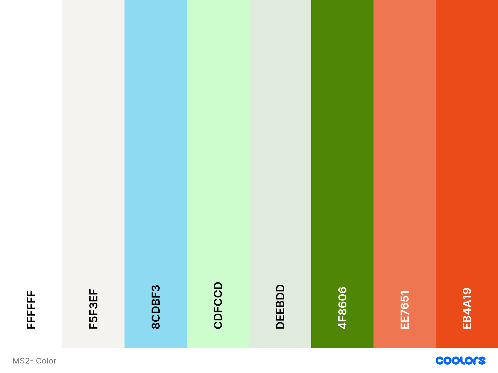

# MS2 - Discover Kerry 

[View live website on GitHub pages](https://damon118.github.io/MS2-Discover-Kerry/)

## Table of Contents 

1. [Introduction](#Introduction) 

2. [UX](#UX)

3. [Features](#Features)

4. [Technologies](#Technologies) 

5. [Testing](#Testing)

6. [Deployment](#Deployment) 

7. [Credits](#Credits)

## Introduction 

The purpose of this project is to promote Co. Kerry in Ireland to prospective visitors and tourists. This is done through captivating and stunning imagery of the landscape
and a detailed description of places to visit and activities to do. It's a 3-page website consisting of a home page, see and do page and a contact page, with an option
to download a brochure and make enquiries for further information. The project will have a broad target market and isn't targeted to any specific cohort of tourists.

The project incorporates a simple, intuitive design provide optimal user experience and produces a real-life demonstration of my development expertise for my interactive frontend 
development milestone project. It’s designed to be responsive and accessible on a range of devices, making it easy to navigate for potential customers. The project can be further 
enhanced and built on to incorporate hotel, room and travel booking functionalities.

## UX 

The UX is simple, user-friendly and intuitive, providing an ease of navigation through the site. 

### 1. Strategy

#### Business Goals 

- The principal purpose of this site is to market Kerry as an amazing holiday destination. 
- Provide a good user experience. 
- Provide clear information on places to visit, with engaging and captivating imagery, and things to do. 
- Have a downloadable brochure which reiterates and compliments the promotional information on the site.
- Build brand awareness.
- Cultivate an interest in visiting Kerry and promote engagement with prospective tourists through the use of a contact form.
- Provide an interactive map for site users with locations and corresponding descriptions.

#### User Stories

- I want to get some background information on Kerry.
- I want to gain information on places to visit in Kerry.
- I want to have different options on things to do and places to visit.
- I want to view the scenery and landscape through imagery.
- I want to be able to find social media links and resources for further information.
- I want to see the recommended spots to visit on an interactive map.
- I want an intuitive site navigation and design. 
- I want to see testimonials from people who have visited Kerry.

### 2. Scope

#### Scope 

- Site aim and purpose is immediately evident to user.
- Intutive interface, allowing the user to decide where they wish to navigate to or what content they want displayed.
- Interactive elements that showcase places to visit and activities to do in Kerry.
- The website has a contact form for any enquiries and social media links to follow.

### 3. Structure 

- The site is organised into three pages.
- The navbar is fixed at the top of the screen and allows the user to navigate to each page. The current page is highlighted in the navbar and the site logo
  links to the home page.
- The carousel on the home page showcases some example of the scenery in Kerry.
- The introduction paragraph on the home page gives the user a brief synopsis on the county. 
- The second page is interactive and the user can make choices about what content is displayed and where they are viewing on the map.
- The content is clearly divided into sections so the user is clear on what the information they are viewing relates to.
- The website contains a form for enquiries.
- The footer has copyright information, a button that links to the contact form and social media links.

#### Interaction design

- Responsive and accesible on a range of devices. 
- Visually pleasing displays. 
- Low number of steps to book a travel consultation or contact.
- The interface interacts with user actions as expected, the scroll/swipe actions respond with the normal behaviour and buttons acts instantly on press. These features generate a predictable
  feel for the user.

#### Information architecture 

- Constructed with a focus on simplicity, so that no extraneous information and functionality is present and overload is avoided.
- The content is organised and prioritised by importance from top to bottom and left to right in terms of position on the page. 

### 4. Skeleton

- Fixed navigation menu with logo and navigation links. Reduces to a dropdown navigation button for small screens.
- Home, Things To Do and Contact Pages.
- Footer with button bringing user to contact form and social media icons.

#### Wireframes 

Home Page - **[View](./assets/wireframes/homepage.png)** 

See & Do - **[View](./assets/wireframes/see&do.png)**

Contact Us - **[View](./assets/wireframes/contact.png)**

- These were the initial wireframes created during the project inception phase. As the project and my skills evolved, so too did the design of the site, hence, the wireframes do not exactly mirror the 
  final project.

### 5. Surface

#### Typography

- The ABeeZee font was the chosen font for the body of this site with Sans Serif as the safe alternative in the case of ABeeZee not being imported 

- ABeeZee is a widespread and visually-pleasing font style. ABeeZee is an open, friendly and simple font developed by Google. I have seen it utilised
  effectively in a number of similar informational websites during my research, and therefore selected it for this project.

#### Imagery 

- The imagery selected is a key feature for attracting prospective visitors and tourists. The large carousel on the home page comprising of three images (see example below) is designed to be captivating, attention-grabbing and
to show an example of the pictureque landscape that Kerry beholds. The purpose of the beautiful imagery is to nurture interest in the area and entice those with an interest in sightseeing or landscapes
into booking a visit or seeking further information.

#### Colour Schemes

- The colours were chosen as they provide an appealing user interface and complement the imagery. The colours are soft, to match the the theme of the website - nature and beauty.

- Green is also one of the official colours of Kerry and indeed, Ireland. The lighter shade of green (#cdfccd) selected for the header, footer and background of the introudction paragraph augments the
  site content and doesn't detract from the images. To keep the colours in alignment with the site theme, and in harmony with the background image, a light and welcoming shade of blue (#8cdbf3b9) was chosen as the colour
  for the contact form.

## Features

### Common Features To All Pages 

- Responsive on all device sizes

- Interactive elements 

- The website is divided into three separate pages - a home page, a things to do page, and a contact page.

- Designed with HTML5, CSS3, Bootstrap, Javascript and jQuery.

- Header 

  - Each page has the same header, with site logo located on the left and a navigation menu with navigation links located on the right within the same row. 
  - The site logo is clickable and will link back to the site homepage 
  - The header is fixed at the top of the screen and will scroll with the page contents, allowing users to easily navigate through the website no matter where they are on the page, hence creating an intuitive design. 
  - The navigations links undergo a colour change when a user's cursor hovers over it. This feature is available only a desktop or laptop but indicates to the site user that the 
    navigation link is clickable.
  - On a mobile device the navigation links will collapse into a dropdown button, with the navigation links displaying on the top left of the screen. 

- Footer 

  - Each page has the same footer which is located at the bottom page and does not scroll with the page contents in order to save screen real estate. 
  - A copyright disclaimer is located on the left of the footer which states the year of creation and content creator.
  - To the middle of the footer, is a button linking to the contact form, which will undergo a colour change when the user's cursor hovers over it. 
  - The company social media links are positioned to the right of the footer and each site is represented by it's relative icon. They will also undergo a colour change when 
    a user's cursor hovers over it, again, showing it's a clickable link.

### Home Page

- Bootstrap carousel with three images
- Introduction section with informative text and map 
- Customer testimonials 
- Download brochure button

### Things To Do Page

- Interactive map with markers
- Places to see and buttons that show location on Google Maps API
- Interactive activities section but buttons that display text about the corresponding activity

### Contact Page

- Contact form with EmailJs integrated
- Large background image of historical site and landscape

### Features to implement in future

- Trustpilot API.
- A partner section where the user can easily book flights, accomadation and transport.
- Option to choose language of website.  
- Google Reviews. 
- FAQ page. 
- Newsletter and email marketing signup option for customers, that would provide information on latest travel offers 

## Technologies

### Programming Languages 

- [HTML5](https://en.wikipedia.org/wiki/HTML5)
- [CSS3](https://en.wikipedia.org/wiki/CSS)
- [Javascript](https://en.wikipedia.org/wiki/JavaScript)

### Version Control

- Gitpod as the Integrated Development Environment (IDE)
- Git as version Control
- Github for repo hosting

### Frameworks, Libraries & Programs Used

#### Bootstrap 

- [Bootstrap](https://getbootstrap.com/) was utilised for it's responsiveness and attractive, visually-pleasing styling features.

#### jQuery

- [jQuery](https://jquery.com/) was used as the Javascript library.

#### Font Awesome 

- [Font Awesome](https://fontawesome.com/) icons were used for aesthetic and user experience design.

#### Google Fonts

- [Google Fonts](https://fonts.google.com/) was chosen as the sole font library due to it's vast and comprehensive nature. 

#### Balsamiq 

- [Balsamiq](https://balsamiq.com/wireframes/?gclid=EAIaIQobChMI9Y3WjKvW7QIVDbDtCh3IqgeyEAAYASAAEgIw1_D_BwE) was used to create the mobile, tablet and desktop wireframes in the UX design.

#### Google Maps API 

- [Google Maps](https://www.google.com/maps) was for the interactive map for prospective visitors.  

#### Logo 

- [Canva](https://www.canva.com) was used to create and edit the site logo. 

#### Mockups 

- [AmIResponsive](http://ami.responsivedesign.is/) was used to create the mockups for the site.

#### Colour Palette

- [Coolors](https://coolors.co/) was used to prepare the colour palette included in this README.md file.

- The images for the carousel were compressed using [tiny png](https://tinypng.com/)

## Testing

- Testing documentation can be found in a separate testing.md file [here](testing.md)

## Deployment

This project was deployed to GitHub Pages using the following protocol: 

1. Sign in to GitHub and select the revelvant repository
2. Click the settings tab in the menu
3. Scroll down to the Settings page until you arrive at the "GitHub Pages" Section
4. Under the source heading, select the gitpod-setup branch option and click save
5. The page will refresh and deployment to GitHub Pages completed
6. Scroll back to the GitHub pages section and click on the link above the source heading to view the live site

### Making a Local Clone 

1. Sign into GitHub
2. Select the relevant repository
3. Select the code dropdown button beside the Gitpod button
4. Download the ZIP file, unpackage locally and open with IDE
5. Alternatively, to clone the repository using HTTPS, copy the link under "Clone with HTTPS"
6. Open Gitbash
7. Alter the current working directory to the location the clone is to be made 
8. Type "git clone" and paste the copied URL 
9. Press enter and the local clone is made

## Credits

### Content 

- All content was written by myself, Damon Gaffney, for the purpose of my Professional Diploma in Full Stack Software Development with Code Institute.
- The information was sourced through a combination of [wikipedia](https://www.wikipedia.org/), [lonely planet](https://www.lonelyplanet.com/), [discover Kerry](https://www.discoverkerry.com/en/)
  [Kerry County Council](https://www.kerrycoco.ie/tourism/), [Kerry Tourism](https://www.kerrytourism.ie/) and my own knowledge.
- The map is from the [Google Maps API](https://developers.google.com/maps)
- The email functionality is provided by [EamilJS](https://www.emailjs.com/)

### Media 

- The three carousel images were obtained from [Unsplash](https://unsplash.com/)
- All remaining images were sourced using the advanced search function in Google Images to select those that were free of copyright. 
- The images for the carousel were compressed using [tiny png](https://tinypng.com/)
- The logo was created by myself with [Canva](https://www.canva.com/)

### Code

- I reveiwed the Code Institute lecture series on implementing EmailJS adapted the methodology to fit my project purpose.
- The visitor testimonials in the homeppage were inspired by the Bootstrapping Your Next Big Idea Videos by Matt Rudge of the Code Institute.
- [Stack Overflow](https://stackoverflow.com/) was used for my toggle button JS code and Google Map with Markers and Description
- [w3schools](https://www.w3schools.com/) as a general reference source.

### Acknowledgements 

- I'd like to thank the community at slack along with the tutor support, who have been absolutely vital to my studies and progress. 
- I'd also like to thank my mentor, Maranatha Ilesanmi, for his time, feedback and help throughout my project.
