## Testing

### Table of Contents 

1. [Code Validity](# Code Validity) 

2. [Performance Testing](# Performance Testing)

3. [User Stories testing](# User Stories Testing)

4. [Known Bugs & Issues](# Known Bugs & Issues)

### Code Validity

#### HTML

- The HTML was validated online using the [W3C Markup Validation Service](https://validator.w3.org/). The site's three pages were separtely validated using this online tool to ensure that there were no 
syntax or structural errors within the code. The results of this testing are indicated below in the relevant sections.

##### 1. index.html 

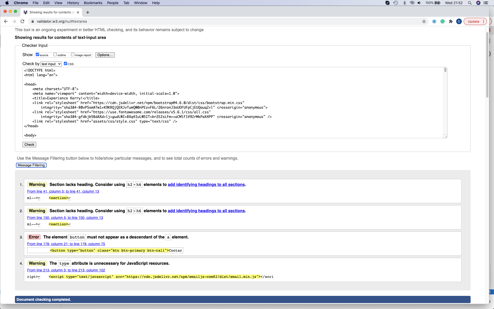

##### 2. index.html (after first attempt)

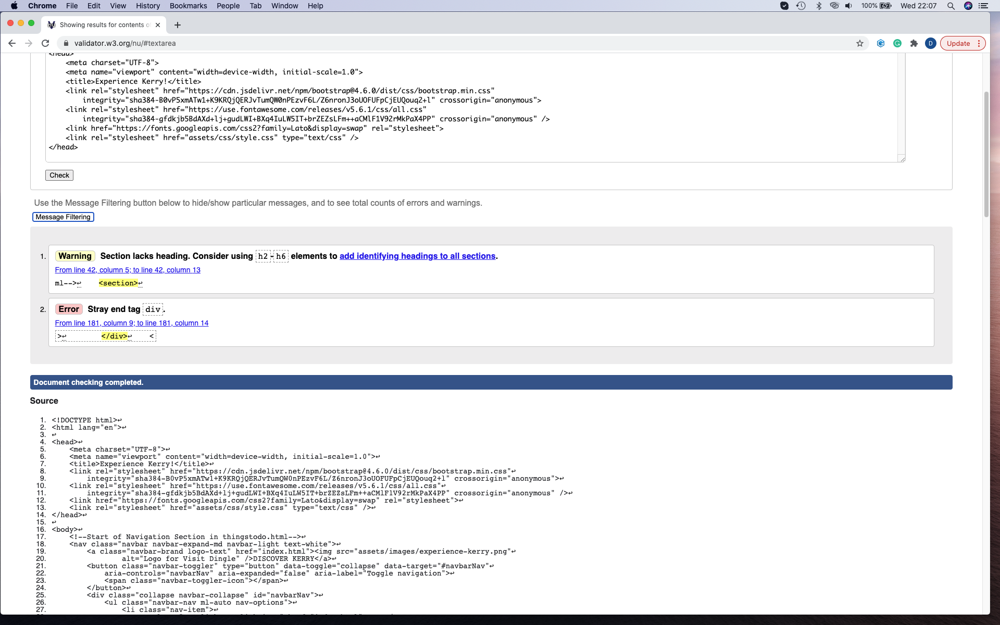

##### 3. thingstodo.html (part 1)

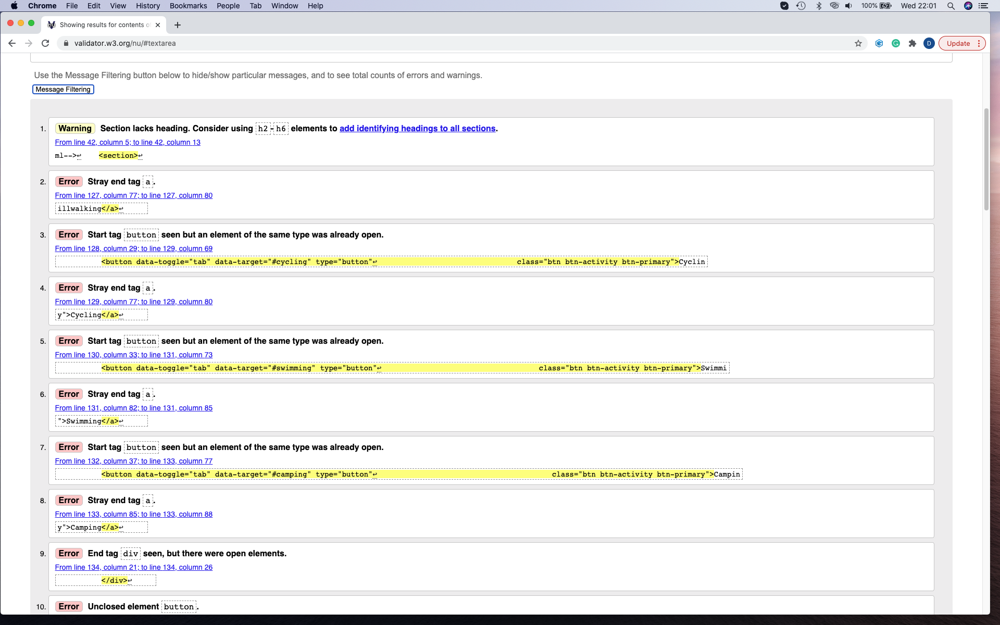

##### 4. thingstodo.html (part 2)

 

##### 5. contact.html

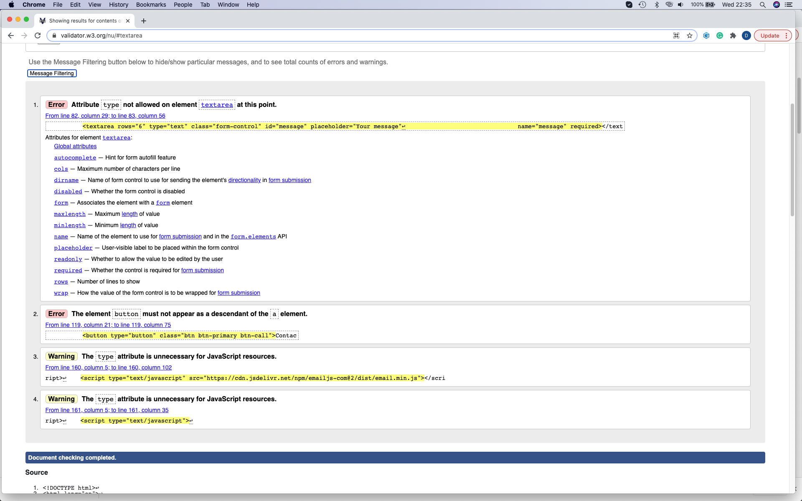 

- The relevant corrections to the index.html page were made in two steps, which are represented by the first two images. Unfortunately, there was quite a number of syntax errors in the thingstodo.html page.
These were rectified and the correct reports displayed below. The first testing of the contact page using the validation tool also came back with two errors and two warnings which are seen above.

#### Valid Code Confirmation 

#### 1. index.html

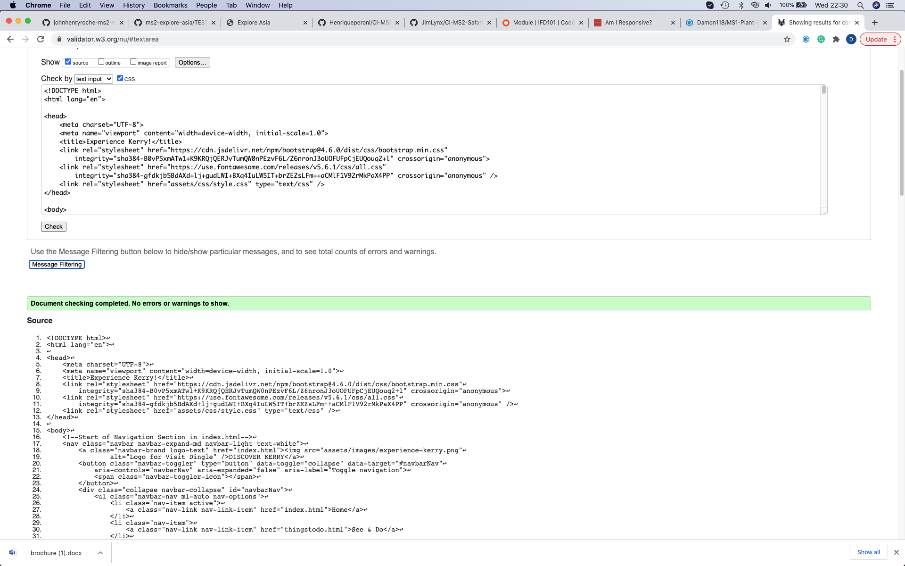

#### 2. thingstodo.html

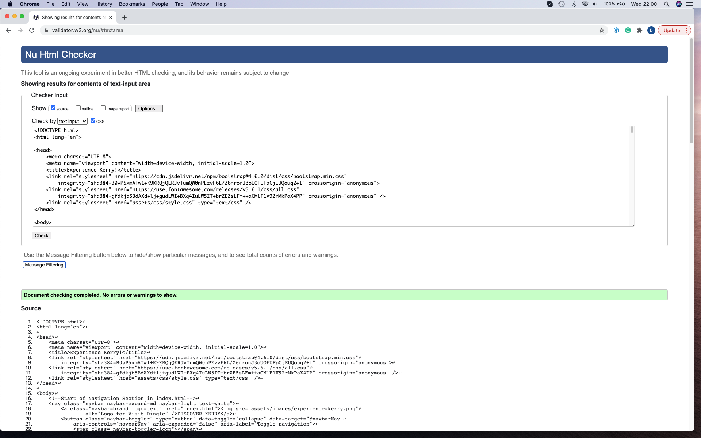

#### 3. contact.html

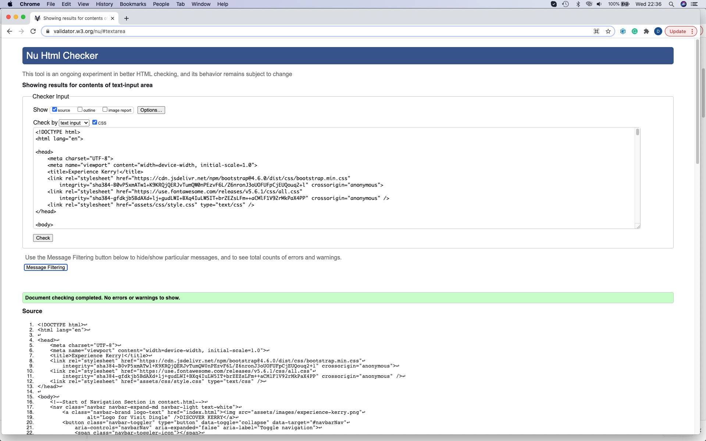

#### CSS 

- The CSS was validated online using the [W3C CSS Validation Service](https://jigsaw.w3.org/css-validator/). The site was validated using this online tool to ensure that there were no 
syntax or structural errors within the code and was entered into the validator tool by direct input. The report came back with no errors.

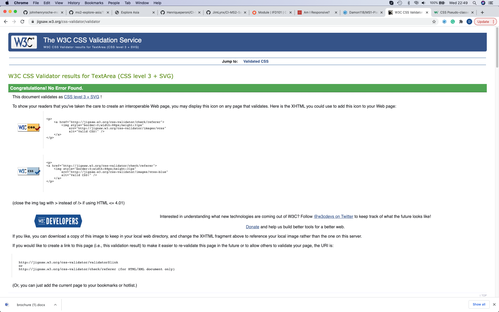

#### JS 

- The JavaScript files were validated using [JSHint](https://jshint.com/) and no errors were recorded. No errors were recorded in the DevTools either.

### Performance Testing 

- The site was tested on Google Chrome, Mozilla Firefox and Safari Web Browsers, and was fully functioning and responsive on all. 

- The website was viewed on a variety of devices such as Desktop, tablet, iPhone 7 & iPhone X. All formats were correctly structured and displayed well. 

- I completed a vast array of detailed and comprehensive testing of my site to ensure that all links functioned correctly. This composed of 
  navigating through each page of my site and clicking every link/button that is available to a user (as part of their UX journey) to ensure that everything was fucntioning correctly. I examined the
  user stories indicated in the UX section of this document to ensure my site achieved each of these objectives.

- I requested the my project be peer viewed twice on Slack by my fellow students. I received several positive reviews and important recommendations which I implemented into my project on both occasions.
  A number of my fellow students tested my site in it's entirety and confirmed the site functioned correctly and as expected. 

- [Responsinator](https://www.responsinator.com/) was used to confirm responsiveness on different device resolutions. 

- [Am I Responsive](http://ami.responsivedesign.is/) was also utilised as a high fidelity responsive design tool for previewing and testing site across a variety of popular devices.

- Lighthouse used within Chrome Dev tools to assess performance on desktop & mobile display, final results below: 

#### Desktop: 

 

#### Mobile: 

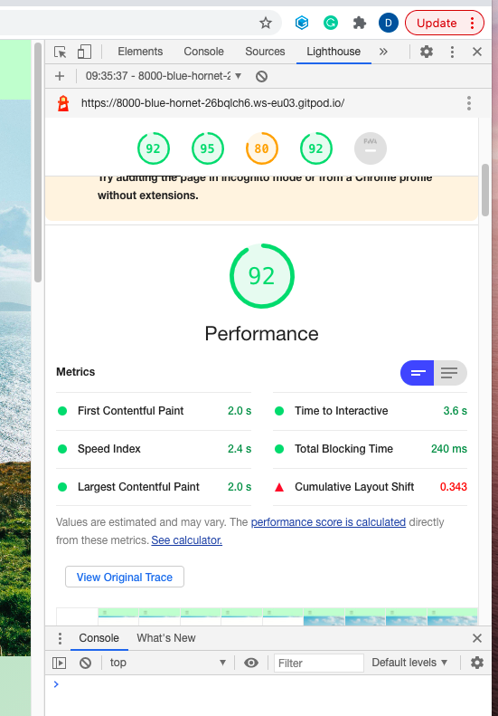

### User Stories Testing

- "I want to get some background information on Kerry." This requirement is met by an informative introduction section on the home page. This provides
the user with some background information on the county and it's appeal as a holiday destination. 

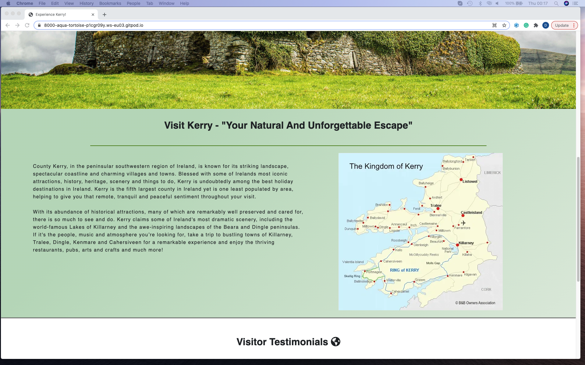

- "I want to gain information on the places to visit in Kerry." This requirement is met through the use of four informative cards on the see and do page. they
represent a brief introduction on four of the most popular tourist towns to visit in Kerry, with a link to view the relevant areas on the map. 

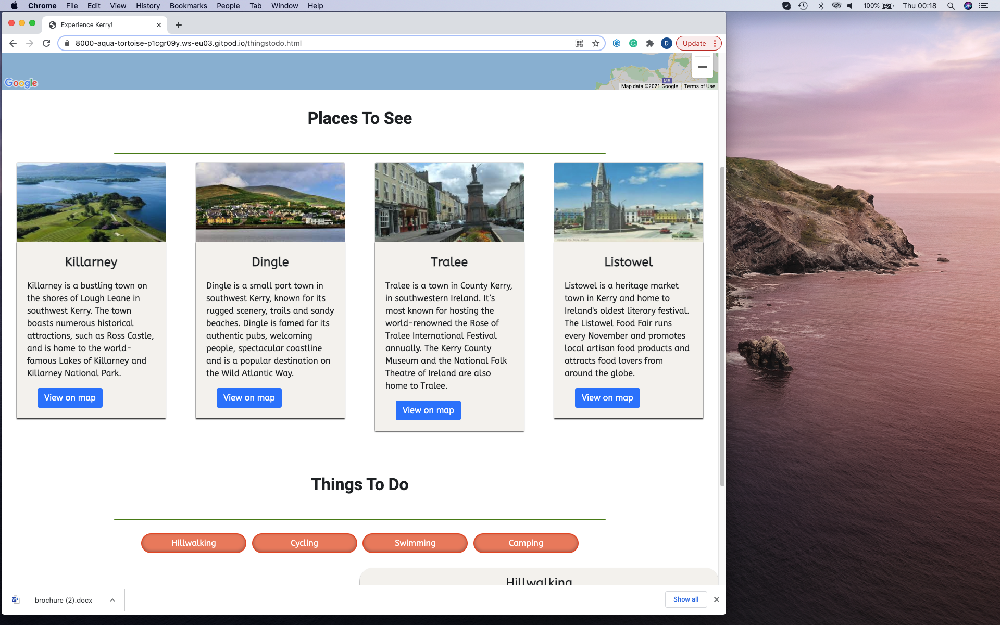

- "I want to have different options on activities to do in Kerry." This requirement is met through the presence of an interactive things to do section. The user is
present with 4 buttons, that when clicked, display information about either hillwalking, cycling, swimming or camping. These would be among the most prominent tourist 
activities people would engage in when visiting Kerry.

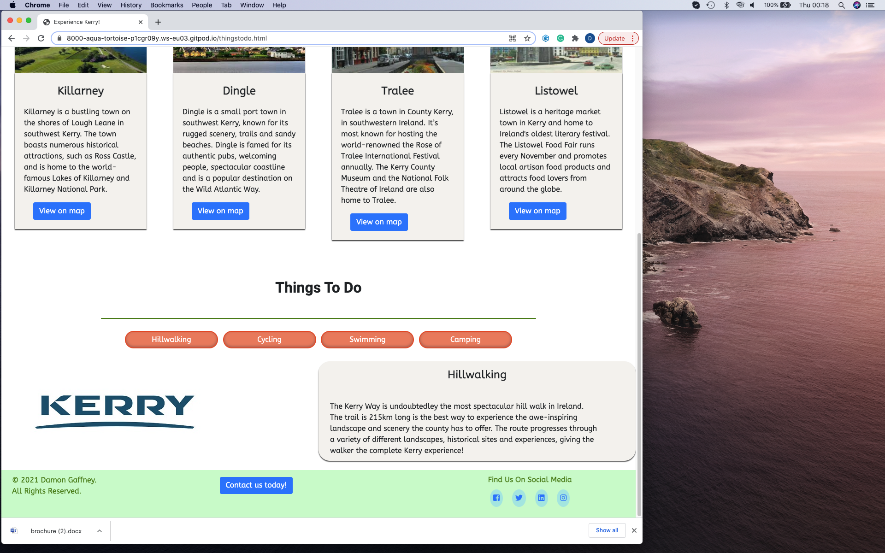

- "I want to view the scenery and landscape through imagery." This requirement is met immediately on the home page. The user is presented with a carousel of three spectacular
images capturing the landscape and scenery that Kerry has to offer. 

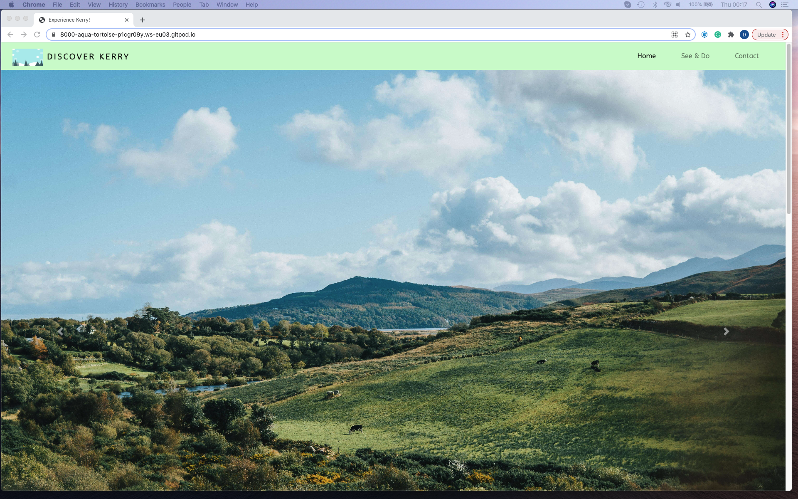

- "I want to be able to find social media links and resources for further information." This requirement is met as the social media links are present in the footer and clickable. The contact 
form and download brochure button provide options for obtaining further information. 

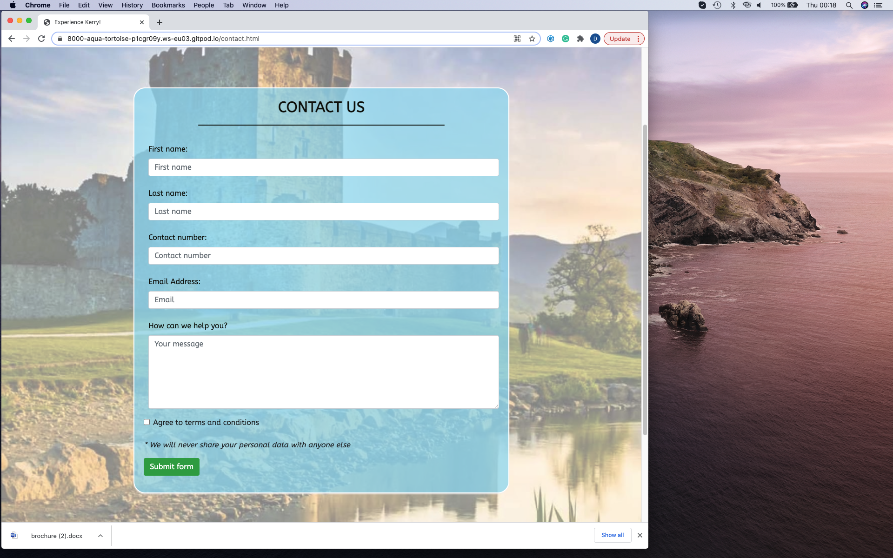

- "I want to see the recommended spots to visit on an interactive map." This requirement is met through the use of the Google Maps Api. There are four markers on the map which correspond to
the recommended places to visit cards. The markers are clickable and provide some further information about the location to the user. 

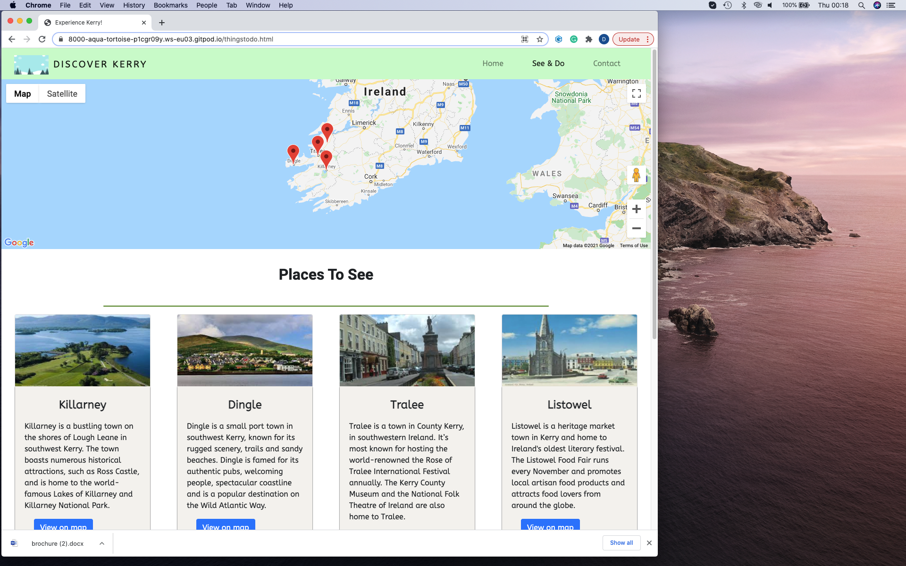
 
"- I want to see testimonials from people who have visited Kerry." This requirement is met through the presence of visitor testimonials on the home page which help inspire confidence
in the site purpose and add that personal touch.

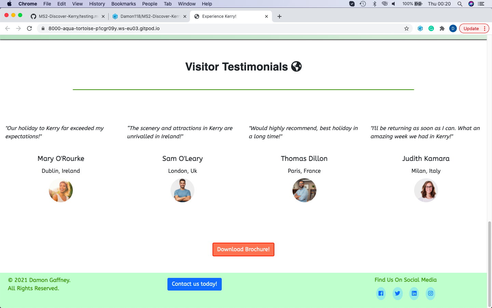

### Known Bugs & Issues

- The contact form length was too excessive on mobile devices so the layout was slightly altered using a media query for small screen sizes

- Removed the fixed-bottom class on the footer as too much screen real estate was being lost in combination with a fixed header. 

- The images in the carousel were compressed using (TinyPNG)[https://tinypng.com/] as they were causing the home page loading time to be too long.

- Unsolved issue: For better UX, I wanted the toggle buttons on the thingstodo.html for the 4 activities to be clickable more than once. Currently,
they can only be clicked once and the corresponding text only displayed once. I will take the neccessary steps to learn how to implement this functionality 
going forward.