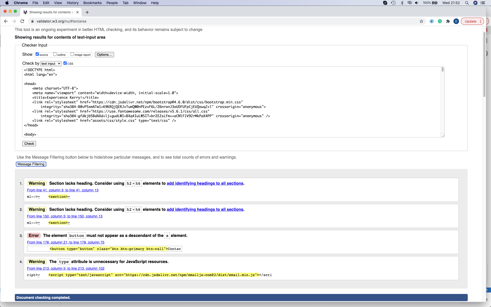
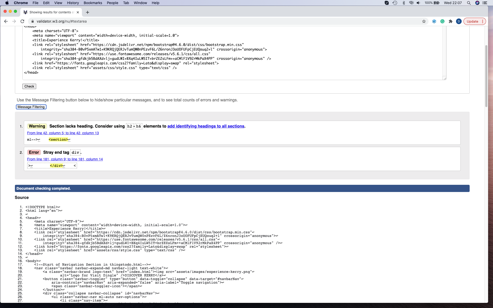
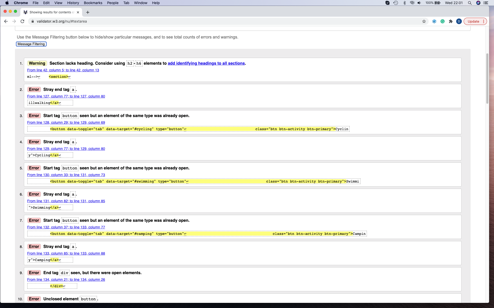
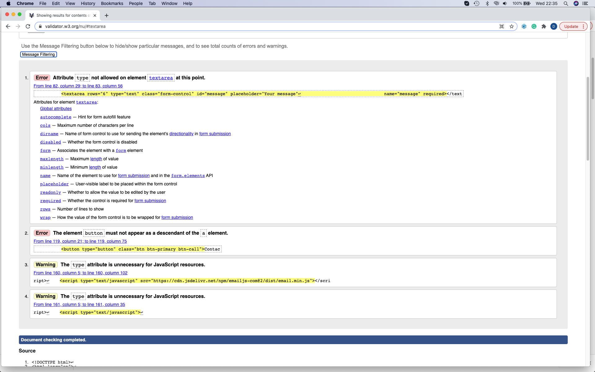
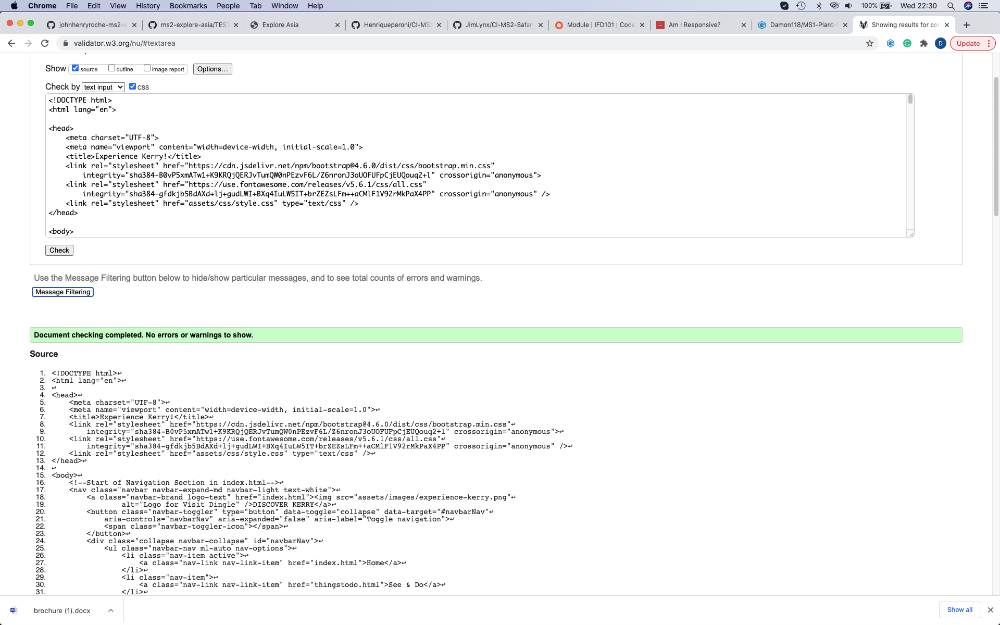
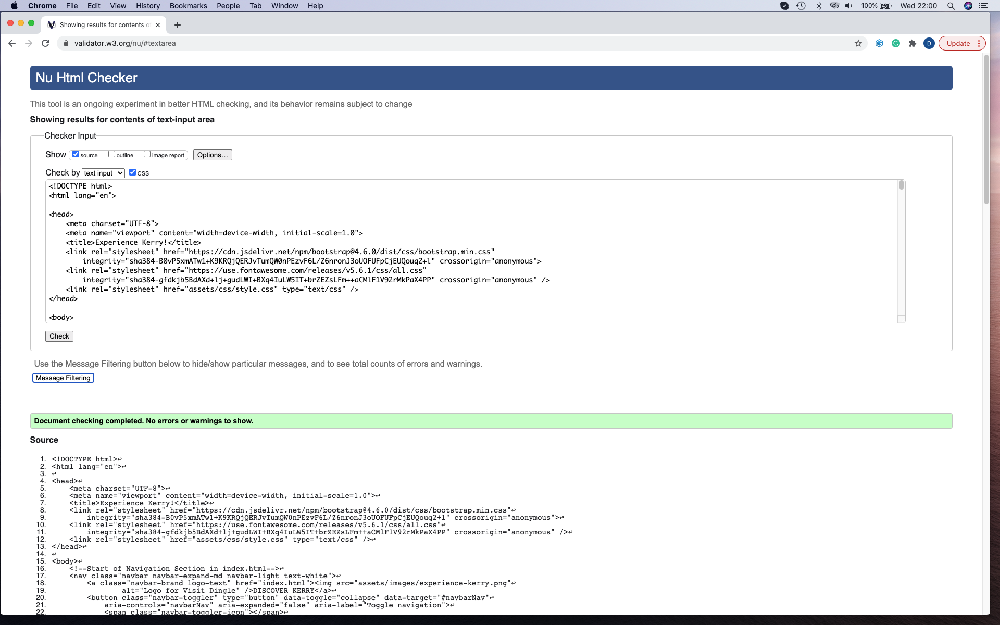
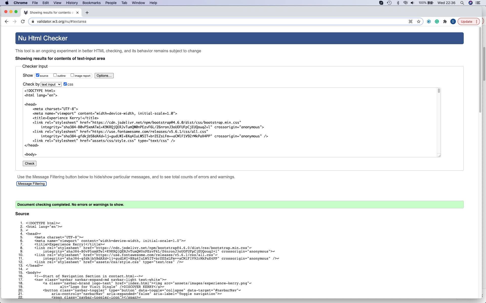

## Testing

### Code Validity

#### HTML

- The HTML was validated online using the [W3C Markup Validation Service](https://validator.w3.org/). The site's three pages were separtely validated using this online tool to ensure that there were no 
syntax or structural errors within the code. The results of this testing are indicated below in the relevant sections.

1. index.html

2. index.html

3. thingstodo.html part 1

4. thingstodo.html part 2
 

5. contact.html
 

- The relevant corrections to the index.html page were made in two steps, which are represented by the first two images. Unfortunately, there was quite a number of syntax errors in the thingstodo.html page.
These were rectified and the correct reports displayed below. The first testing of the contact page using the validation tool also came back with two errors and two warnings which are seen above.

###### Valid Code Confirmation 

1. index.html

2. thingstodo.html

3. contact.html

#### CSS 

