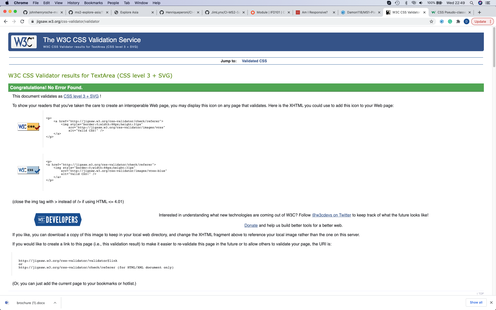
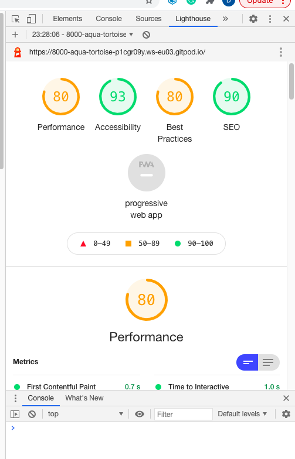
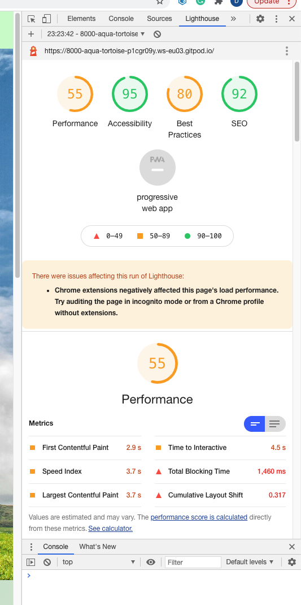

## Testing

### Code Validity

#### HTML

- The HTML was validated online using the [W3C Markup Validation Service](https://validator.w3.org/). The site's three pages were separtely validated using this online tool to ensure that there were no 
syntax or structural errors within the code. The results of this testing are indicated below in the relevant sections.

##### 1. index.html 

##### 2. index.html (after first attempt)

##### 3. thingstodo.html part 1

##### 4. thingstodo.html part 2

 

##### 5. contact.html

 

- The relevant corrections to the index.html page were made in two steps, which are represented by the first two images. Unfortunately, there was quite a number of syntax errors in the thingstodo.html page.
These were rectified and the correct reports displayed below. The first testing of the contact page using the validation tool also came back with two errors and two warnings which are seen above.

###### Valid Code Confirmation 

##### 1. index.html

##### 2. thingstodo.html

##### 3. contact.html

#### CSS 

- The CSS was validated online using the [W3C CSS Validation Service](https://jigsaw.w3.org/css-validator/). The site was validated using this online tool to ensure that there were no 
syntax or structural errors within the code and was entered into the validator tool by direct input. The report came back with no errors.

#### JS 

- The JavaScript files were validated using JSHint and no errors were recorded. No errors were recorded in the DevTools either.

### Performance Testing 

- The site was tested on Google Chrome, Mozilla Firefox and Safari Web Browsers, and was fully functioning and responsive on all. 

- The website was viewed on a variety of devices such as Desktop, tablet, iPhone 7 & iPhone X. All formats were correctly structured and displayed well. 

- I completed a vast array of detailed and comprehensive testing of my site to ensure that all links functioned correctly. This composed of 
  navigating through each page of my site and clicking every link/button that is available to a user (as part of their UX journey) to ensure that everything was fucntioning correctly. I examined the
  user stories indicated in the UX section of this document to ensure my site achieved each of these objectives.

- I requested the my project be peer viewed twice on Slack by my fellow students. I received several positive reviews and important recommendations which I implemented into my project on both occasions.
  A number of my fellow students tested my site in it's entirety and confirmed the site functioned correctly and as expected. 

- [Responsinator](https://www.responsinator.com/) was used to confirm responsiveness on different device resolutions. 

- [Am I Responsive](http://ami.responsivedesign.is/) was also utilised as a high fidelity responsive design tool for previewing and testing site across a variety of popular devices.

- Lighthouse used within Chrome Dev tools to assess performance on desktop & mobile display, final results below: 

#### Desktop: 

 

#### Mobile: 

